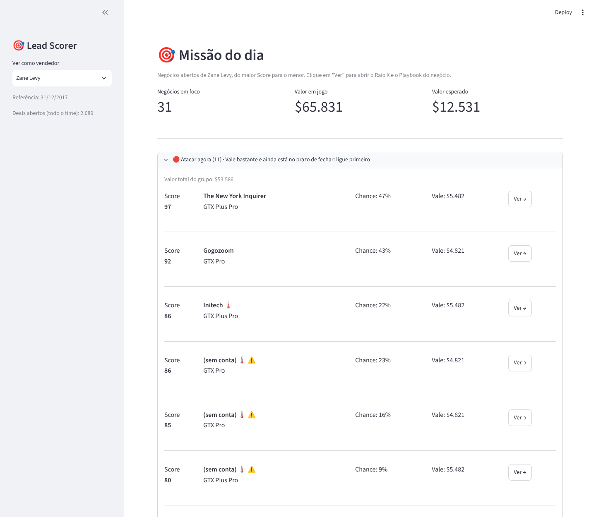
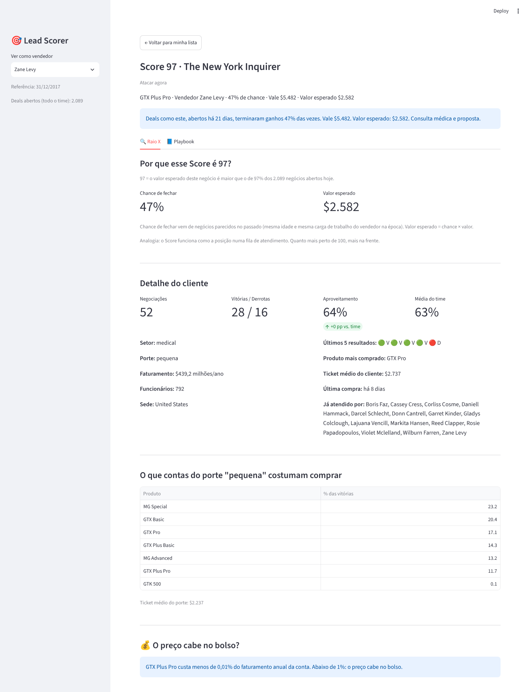
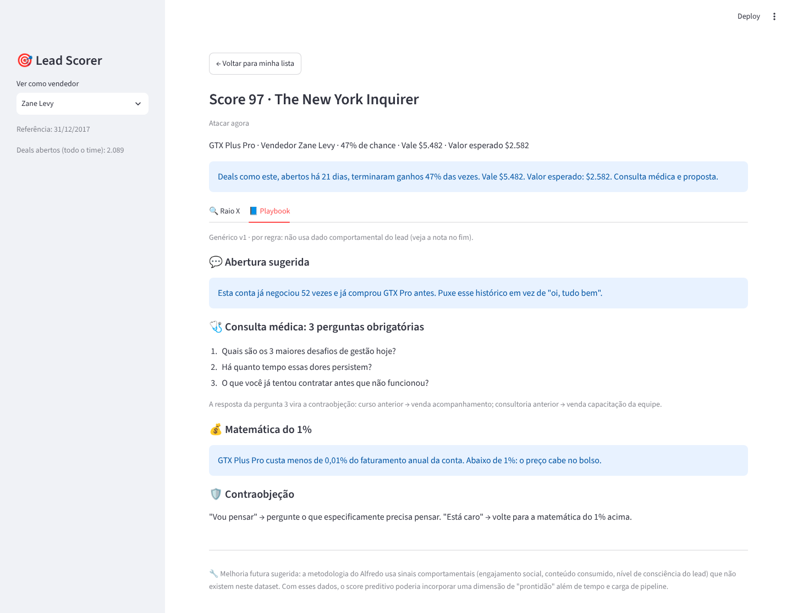

# Submissão — Hugo Oliveira — Challenge 003

## Sobre mim

- **Nome:** Hugo Oliveira
- **LinkedIn:** [linkedin.com/in/hugo-oliveira-b0707277](https://www.linkedin.com/in/hugo-oliveira-b0707277)
- **Challenge escolhido:** 003, Lead Scorer (Vendas / RevOps)

---

## Executive Summary

Construí um app em Streamlit que o vendedor abre na segunda de manhã e vê, numa tela só, os negócios dele separados pela próxima ação ("Atacar agora", "Fechar rápido", "Qualificar em 14 dias"...), cada um com Score de 0 a 100 e chance de fechar; ao abrir o negócio, uma frase explica o número. Por trás está o Clima do Deal, um algoritmo que testou os sinais que eu uso como vendedor e manteve só os que provaram nos dados: o perfil do cliente (setor, porte, sede) não prevê se o deal fecha; a idade do deal e a carga de trabalho do vendedor preveem. Nenhuma venda da base fechou depois de 138 dias aberta, e hoje 1.291 dos 2.089 deals abertos já passaram disso ($3,2 milhões parados). Numa simulação de 16 segundas com 30 vendedores, escolher os deals da semana pelo Score rendeu 52,5% mais receita do que perseguir o maior valor e 5% mais que o feeling, com menos da metade dos deals. Recomendo um piloto de 30 dias com metade do time para medir o efeito real.

---

## Solução



### Como rodar

Requer Python 3.10 ou mais recente. Os dados do dataset (licença CC0) já estão em `solution/data/`.

```bash
cd submissions/hugo-oliveira/solution
pip install -r requirements.txt
streamlit run app.py
```

Abre em http://localhost:8501. A primeira carga leva de 10 a 30 segundos, conforme a máquina, porque calcula o pipeline inteiro; depois fica em cache. Na barra lateral, "Ver como vendedor" troca o vendedor; o app abre no que tem mais negócios em foco.

Para conferir os números deste README:

```bash
pytest                              # 34 testes das regras
python -m lead_scorer.validacao     # simulação das segundas e autoteste dos sinais
python analises/fator_carga.py      # efeito do fator carga
```

### Abordagem

1. **Dados antes do modelo.** Testei se o perfil do cliente separa ganho de perda: setor, porte, funcionários, sede, grupo, histórico da conta e do vendedor. Cada sinal passou por um autoteste temporal: aprende com o que fechou antes de 01/07/2017 e é testado nos deals que começaram depois. Nenhum sinal de perfil passou. O tempo desde o engage passou.
2. **Clima do Deal.** Transformei o tempo em chance com uma tábua de sobrevivência: para cada idade, quantos deals que chegaram até ali terminaram ganhos. A curva conta também os deals que continuam abertos; sem isso, ela conclui que deal velho é bom (foi o erro da primeira versão).
3. **Score e ação.** Score = chance × valor, em percentil, para ordenar a fila. O rótulo diz o que fazer com cada deal.
4. **Validação.** Simulei 16 segundas: em cada uma, cada vendedor escolhe 5 deals para a semana por três critérios (Score, maior valor e sorteio), sem olhar o futuro.
5. **Tela pelo vendedor.** Mockup clicável primeiro, ajustado com o meu olhar de KAM, depois o código.

### O algoritmo: Clima do Deal

O Score responde "qual deal atacar primeiro". O Clima do Deal responde a pergunta que vem antes: "qual a chance real de este deal fechar?". A ideia é a da previsão do tempo, que junta vários sinais (temperatura, umidade, vento) numa chance de chuva. Aqui, cada sinal só entra se provar nos dados que ajuda a prever.

**O desenho de partida.** Listei os 7 parâmetros que eu, como vendedor, usaria para prever um fechamento: tempo em aberto, faturamento, segmento, histórico de compra, engajamento em redes sociais, localização e vendedor. Engajamento não existe na base e foi para a v2. Com os outros, a primeira fórmula foi multiplicativa:

```
CHANCE = CHANCE_BASE(idade) × FATOR_VENDEDOR × FATOR_SETOR × FATOR_CONTA × FATOR_REGIÃO
```

Cada fator é a taxa de ganho do grupo dividida pela média: vendedor que ganha 10% acima da média vale 1,10. Uma correção minha no desenho: o tempo em aberto não é mais um fator, é o ponto de partida; colocá-lo de novo contaria o tempo duas vezes. O rascunho dessa versão está em [`process-log/desenho-inicial-clima-deal.md`](process-log/desenho-inicial-clima-deal.md).

**Por que abortamos esse desenho.** A primeira simulação calculou os fatores com o resultado dos mesmos deals que avaliava, misturando passado e futuro, e deu um resultado bom demais. No autoteste do projeto, que aprende com o que fechou antes de 01/07/2017 e testa nos deals que começaram depois, vendedor, setor e conta inverteram o sinal: o grupo que era melhor no passado foi pior no futuro. Um fator que inverte piora a lista, então saiu.

**O que cada parâmetro mostrou.** Um sinal liga com 5 pontos de diferença ou mais e 200 casos ou mais (`python -m lead_scorer.validacao` e `python analises/fator_carga.py`):

| Parâmetro | Como foi testado | Resultado no teste | Ficou? |
|---|---|---|---|
| Tempo em aberto | Tábua de sobrevivência por idade | Até 90 dias, 44% a 49% ganham; de 91 a 138, 21%; depois de 138, nenhum | Sim: é a base |
| Faturamento | Porte da conta (tercis de receita) | +1,5 pontos | Não |
| Segmento | Setor da conta | -2,4 pontos | Não |
| Histórico de compra | Taxa de ganho da conta; tempo desde a última compra | -0,6 e -9,2 pontos | Não |
| Localização | Sede da conta | -0,2 pontos | Não |
| Vendedor | Taxa de ganho do vendedor | -2,8 pontos | Não |
| Vendedor | Carga: quantos deals ele tinha abertos quando o deal começou | +8,6, +9,8 e +8,3 pontos em 3 janelas | Sim: fator carga |
| Região e gerente do time | Escritório e gerente do vendedor | +15,6 e +9,5 pontos | Só para o gerente: são iguais para toda a carteira do vendedor |
| Engajamento | Não existe na base | | Para a v2 |

Também caíram: número de funcionários (-2,0) e fazer parte de um grupo (-5,4). Idade da conta (+2,7) ficou em observação.

**O algoritmo que ficou** (`solution/lead_scorer/clima.py`):

```
CHANCE = CHANCE_BASE(idade) × FATOR_CARGA(pouca, média ou muita carga)
```

- **Multiplicativo:** cada fator diz quanto o contexto sobe ou desce a chance de partida, e o vendedor entende ("49% pela idade, um pouco menos porque a carteira estava cheia").
- **Carga relativa ao time:** "pouca", "média" e "muita" são tercis da carga do momento. As carteiras crescem ao longo do ano; com cortes fixos do passado, só 27 a 79 deals por janela caíam em "pouca carga" e o teste ficava sem amostra.
- **Piso de 5%:** nenhum deal é dado como impossível, nem o que passou de 138 dias.
- **Na sessão em que desenhamos a carga,** um teste feito na conversa (sem script no repositório) deu +15,7 pontos. O número reproduzível é o da tabela acima; a conclusão é a mesma: a carga entra.

**Melhorias da v2:**

| Melhoria | Por que | Dado necessário |
|---|---|---|
| Engajamento e nível de consciência do lead | Pela metodologia do Alfredo Soares, lead engajado e consciente da dor fecha mais rápido | Registro de interações: e-mails, ligações, demos, conteúdo consumido |
| Recência com decaimento | Uma interação de ontem vale mais que uma de três meses atrás | Datas das interações |
| NPS e histórico de suporte | Cliente satisfeito volta a comprar; chamado aberto trava a venda | Dados de atendimento |
| Tamanho do deal em relação ao cliente | Deal pequeno para conta grande tende a fechar mais fácil | Já existe na base (matemática do 1%); falta testar como fator |
| Pesquisa Win/Lost | Mede o motivo real da perda e substitui o piso de 5% | 5 perguntas ao fechar o deal |

### Como o Score funciona

- **Chance de fechar:** o Clima do Deal, descrito acima (idade do deal × carga do vendedor).
- **Valor esperado:** chance × preço de tabela do produto.
- **Score (0 a 100):** posição do valor esperado entre os 2.089 deals abertos. Score 90 = valor esperado maior que o de 90% do pipeline.
- **Estados pelo tempo desde o engage:** novo (0 a 14 dias), ativo (15 a 90), esfriando (91 a 138, com o selo "última tentativa esta semana"), sem precedente (mais de 138: nenhuma venda da base fechou depois disso) e a qualificar (Prospecting, ainda sem engage).

| Rótulo | Regra | Abertos | O que fazer |
|---|---|---|---|
| Atacar agora | Ativo ou esfriando, produto de $3.393 ou mais | 120 | Consulta médica e proposta |
| Fechar rápido | Ativo ou esfriando, produto mais barato | 171 | Fechar com esforço mínimo |
| Qualificar em 14 dias | Prospecting ou novo | 507 | Consulta médica em até 14 dias |
| Nutrição de elite | Sem precedente, com conta, valor alto | 180 | Régua de 90 dias com o vendedor |
| Limpar ou automação | Sem precedente, com conta, valor baixo | 232 | Régua automática ou fechar como Lost |
| Completar cadastro ou limpar | Sem precedente, sem conta | 879 | Completar o cadastro em 7 dias ou fechar |

Os parâmetros (limites de 14 e 90 dias, piso de 5%, valor alto) ficam em `solution/config.py`; a data de referência (31/12/2017) e o limite de 138 dias saem dos próprios dados. O desenho completo está em [`docs/PRD.md`](docs/PRD.md).

### O que o vendedor vê

1. **Missão do dia** (print acima): os negócios do vendedor agrupados pela ação, do maior Score para o menor. "Atacar agora" e "Fechar rápido" abrem no topo; os selos 🌡️ esfriando e ⚠️ sem cadastro aparecem na linha.
2. **Detalhe do lead, aba Raio X:** o porquê do Score em linguagem simples, a chance e o valor esperado, a dica para reverter cada selo, a ficha da conta (negociações, vitórias, aproveitamento contra o time, últimos 5 resultados, produto mais comprado), o que contas do mesmo porte compram e a matemática do 1% (o preço cabe no faturamento do cliente?).
3. **Aba Playbook:** abertura sugerida pelo histórico da conta, as 3 perguntas da consulta médica, a matemática do 1% e a contraobjeção do momento, com base na metodologia de vendas do Alfredo Soares.

| Raio X | Playbook |
|---|---|
|  |  |

Selos com dica para reverter: [esfriando](docs/screenshots/04-esfriando.png) e [sem cadastro e esfriando](docs/screenshots/05-sem-cadastro.png).

### Resultados / Findings

**Simulação das segundas** (16 segundas de maio a agosto de 2017, 30 vendedores, 5 deals por semana; o resultado de cada deal é conferido até 31/12/2017 e cada deal conta uma vez na receita). Vendedor médio:

| | Feeling (sorteio) | Maior valor | Score (Clima) |
|---|---|---|---|
| Semanas de foco em deal que terminou ganho | 43% | 40% | **48%** |
| Tempo em deal que nunca fechou | 36% | 41% | **31%** |
| Deals trabalhados em 16 semanas | 54 | 14 | 23 |
| Receita dos deals trabalhados | $57,3 mil | $39,6 mil | **$60,3 mil** |

A coluna Score usa a chance só pela idade, como na simulação oficial. Com o fator carga, como no app, o resultado fica praticamente igual: +52,4% contra o maior valor, +5,2% contra o feeling e 49,3% das semanas em deal ganho.

- **+52,5% de receita contra quem persegue o maior valor.** O Score ganha em 26 de 30 vendedores.
- **+5% contra o feeling, com menos da metade dos deals.** O Score ganha em 19 de 30 vendedores.
- **A curva certa importa:** com a primeira versão da curva (que só aprendia com deals fechados), a receita seria $47,5 mil, abaixo do feeling.

**Fator carga** (`analises/fator_carga.py`): passou no autoteste nas 3 janelas (+8,6, +9,8 e +8,3 pontos para quem tem pouca carga). Na simulação das segundas, ele não muda a receita (-0,04%), mas sobe o acerto semanal de 48,2% para 49,3% e a nota de ordenação de 0,652 para 0,667 (0,5 é cara ou coroa). Ou seja, deixa a lista mais certeira sem trocar os deals que mais valem.

**O pipeline hoje** (31/12/2017): 2.089 deals abertos, $4,97 milhões a preço de tabela. 1.291 deles (62%, $3,2 milhões) estão abertos há mais de 138 dias, sem precedente de fechamento. 1.425 (68%) não têm conta cadastrada. 6 de 27 vendedores não têm nenhum deal para atacar ou fechar rápido.

### Recomendações

1. **Piloto de 30 dias** com metade do time usando a lista, medindo receita e horas. A simulação mede a qualidade da lista, não a causa; o piloto mede a causa.
2. **Limpar o pipeline:** 879 deals sem conta e sem precedente ($2,13 milhões) poluem a carteira. Completar o cadastro em 7 dias ou fechar como Lost.
3. **Pesquisa Win/Lost** com 5 perguntas obrigatórias ao fechar (motivo, objeção, decisor, concorrente, origem do lead), para alimentar o autoteste e substituir o piso de 5%.
4. **Dados comportamentais na v2 do score:** engajamento, conteúdo consumido e nível de consciência do lead (pedidos pela metodologia do Alfredo Soares) não existem nesta base. Com eles, o score ganha uma dimensão de prontidão.
5. **Visão do gerente:** a região do escritório de vendas e o gerente passaram no autoteste (+16 e +10 pontos), mas são iguais para todos os deals de um vendedor e não mudam a lista dele. Servem a um painel de gerente, fora desta entrega.

### Limitações

- **Base sintética:** só o tempo e a carga do vendedor se sustentaram no teste. O corte de 138 dias é desta base; num CRM real, a curva deve ser recalculada.
- **A simulação não mede causa:** supõe que dar atenção a um deal não muda a chance dele. Em 11 de 30 vendedores, o sorteio rendeu mais que o Score.
- **O fator carga pode ser causalidade reversa:** vendedor bom fecha rápido, esvazia a carteira e aparece com "pouca carga". Não dá para separar isso com esta base.
- **A carga é relativa ao time:** a faixa de cada deal depende da carga dos outros naquele momento (o fator aprende com os tercis dos deals fechados e é aplicado com os tercis dos abertos). Num CRM real, vale recalibrar os cortes a cada trimestre.
- **68% dos deals abertos não têm conta:** o Raio X fica sem ficha para eles, e "sem conta" não pode virar sinal (na base, só deal aberto fica sem conta).
- **Premissas configuráveis:** piso de 5% para deal sem precedente e chance do dia 0 para Prospecting.
- **Fora desta versão:** visão do gerente, gravação da consulta médica e da pesquisa Win/Lost, envio automático da régua de nutrição e playbook personalizado por lead (o atual é por regra).
- **Desempenho:** a carga de cada deal é calculada com laços em Python; para um CRM maior, o cálculo precisa ser vetorizado.

---

## Process Log — Como usei IA

O log completo, sessão por sessão e com os erros da IA numerados, está em [`process-log/README.md`](process-log/README.md).

### Ferramentas usadas

| Ferramenta | Para que usei |
|---|---|
| Claude (chat com acesso aos dados, ao Mac, ao Notion e ao Todoist) | Raio-x dos CSVs, teste das hipóteses, PRD, plano em fases, simulação das segundas, cronograma e o código das Fases 1 a 3 (dados, Clima, Score e Raio X) |
| Claude Code (local, Sonnet) | Revisão independente e commit da Fase 3; primeira versão do app (Fase 4) |
| Claude no app desktop (com acesso ao Mac) | Mockup clicável da tela do vendedor, construção do app, auditoria final, prints e este README |

### Workflow

1. Li o desafio e escolhi o 003 pelo encaixe com a minha experiência de KAM B2B priorizando carteira.
2. Pedi um raio-x dos dados e testei a minha tese de vendedor (prever os deals abertos pelos que já fecharam) antes de pedir código.
3. Com a IA, escrevi o PRD e um plano em 7 fases, com a regra "a IA propõe, eu aprovo".
4. Validei a lógica com a simulação das segundas antes de construir a interface. Ela derrubou a primeira curva.
5. Código em fases pequenas, com testes e revisão independente: o Claude Code revisou a Fase 3 antes do commit, e um revisor separado conferiu a entrega final.
6. Testei o app como vendedor, rejeitei a tela de gerente e refiz a interface a partir de um mockup.
7. Auditoria final: rodei a validação, conferi cada número deste README no código e instalei tudo do zero numa máquina limpa.

### Onde a IA errou e como corrigi

| Erro da IA | Como percebi | Correção |
|---|---|---|
| A primeira curva só aprendia com deals fechados e dizia que deal velho era o melhor (76% aos 120 dias) | Simulação das segundas: de 91 a 138 dias, só 21% ganharam | Curva que conta também os abertos (tábua de sobrevivência) |
| O A/B somava o mesmo deal várias vezes na receita | Conferindo a conta | Cada deal conta uma vez: +5% contra o feeling, +52,5% contra o maior valor |
| O Raio X usaria vitórias do futuro com outra data de referência | Revisão independente no Claude Code | Filtro pela data de referência e 2 testes novos |
| Citou um Score e um preço de produto sem rodar os dados | Desconfiei da explicação e cobrei a conferência na base | Regra nova: nenhum número sem rodar o código |
| Achou fatores (vendedor, setor, conta) com treino e teste misturados no tempo | O autoteste do projeto derrubou os três: no período de teste, o sinal se inverteu | Só entra sinal que passa no autoteste |
| Reescreveu o `clima.py` inteiro e quebrou 1 teste; o README que escreveu tinha números que o código não reproduz | Auditoria final rodando `pytest` e a simulação | Teste corrigido, README refeito só com números reproduzíveis, teste do fator carga versionado |
| Commitou um arquivo de configuração local fora da pasta da submissão | Auditoria contra o CONTRIBUTING | Removido do git antes do PR |

### O que eu adicionei que a IA sozinha não faria

- **O olhar de quem vende:** a pergunta não é "qual deal tem a maior nota", é "o que eu faço na segunda de manhã". Por isso o rótulo de ação vem antes do número, a linguagem é de vendedor, cada selo traz uma dica para reverter e as ações de foco são verde e azul (vermelho só para alerta).
- **O desenho do Clima do Deal:** os 7 sinais que eu uso para prever um fechamento e a correção de que o tempo é o ponto de partida, não mais um fator. A IA testou cada sinal; eu decidi o que entrava.
- **Rejeitar a tela de gerente:** a primeira versão seguia o PRD com 6 abas e filtros. Testando como vendedor, vi que ela não respondia ao pedido da Head de RevOps e refiz a interface pelo vendedor.
- **A metodologia do Alfredo Soares** no Raio X e no Playbook: consulta médica, matemática do 1% e régua de nutrição.
- **Não inventar dado:** engajamento em redes sociais não existe na base, então virou recomendação para a v2, não um número fabricado.
- **Desconfiar de resultado bom demais:** exigi a simulação e o autoteste antes de aceitar qualquer sinal novo, e uma auditoria antes de abrir o PR.

---

## Evidências

- [x] Screenshots do app: [`docs/screenshots/`](docs/screenshots/)
- [ ] Screen recording do workflow
- [ ] Chat exports
- [x] Git history: commits pequenos e descritivos na branch `submission/hugo-oliveira`
- [x] Outro: narrativa por sessão em [`process-log/README.md`](process-log/README.md), prompt de uma das tarefas em [`process-log/prompts/`](process-log/prompts/) e documento de requisitos em [`docs/PRD.md`](docs/PRD.md)

---

_Submissão enviada em: (a preencher no dia do PR)_
